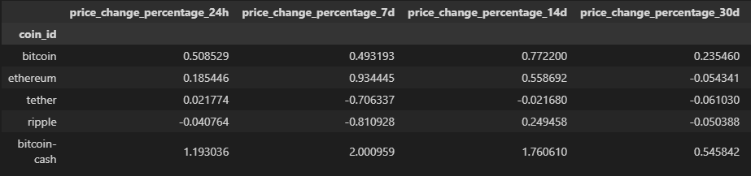
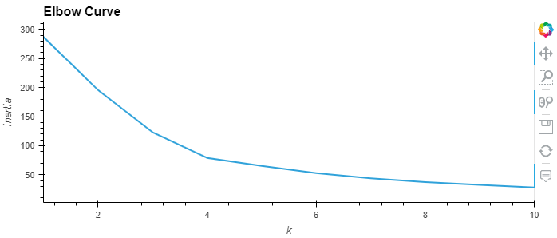
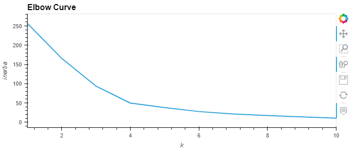
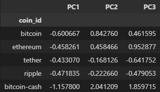
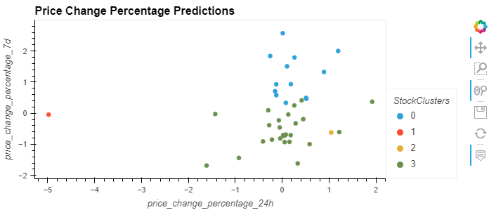
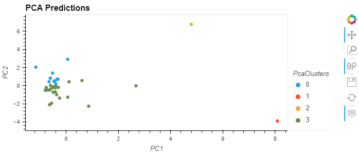

# CryptoClustering
## Module 19 Challenge
For this assignment I worked with Python and unsupervised learning to predict if cryptocurrencies are affected by 24-hour or 7-day price changes.

## Preparing the Data
I used the StandardScaler() module from scikit-learn to normalize the data from the original CSV file. I then created a DataFrame with the scaled data. 

## Finding the Best Value for K
Using the elbow method I found the best value for K by plotting the elbow curve on a line graph with hvplot using the inertia values computed with different values of K to visually identify the optimal k value. 

## Clustering Cryptocurrencies with K-means
I initialized the K-means model with the best value for k found previously and fit the model using the original scaled DataFrame. I then predicted the clusters to group the cryptocurrencies and created a scatter plot using hvPlot with the price change percentage of 24hrs and the price change percentage of 7 days. 

## Optimize Clusters with Principal Component Analysis
Using the original scaled DataFrame, I performed a PCA and reduced the features to three principal components. After retrieving the explained variance I determined how much information can be attributed to each principal component, then created a DataFrame with the PCA data.

## Find the Best Value for k Using the PCA Data 
Using the elbow method I found the best value for K using the previous PCA data by plotting the elbow curve on a line graph with hvplot using the inertia values computed with different values of K to visually identify the optimal k value. 

## Clustering Cryptocurrencies with K-means Using the PCA Data
I initialized the K-means model with the best value for k found previously and fit the model with the PCA data. I then predicted the clusters to group the cryptocurrencies and created a scatter plot using hvPlot with PC1 and PC2. 

## References
Data for this dataset was generated by edX Boot Camps LLC, and is intended for educational purposes only.